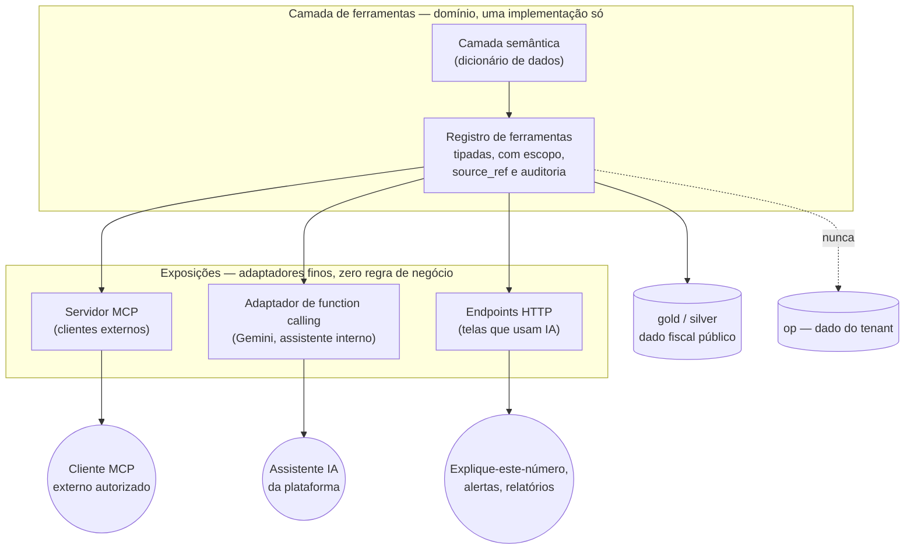
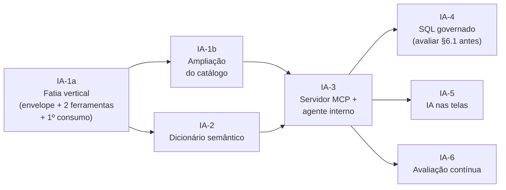
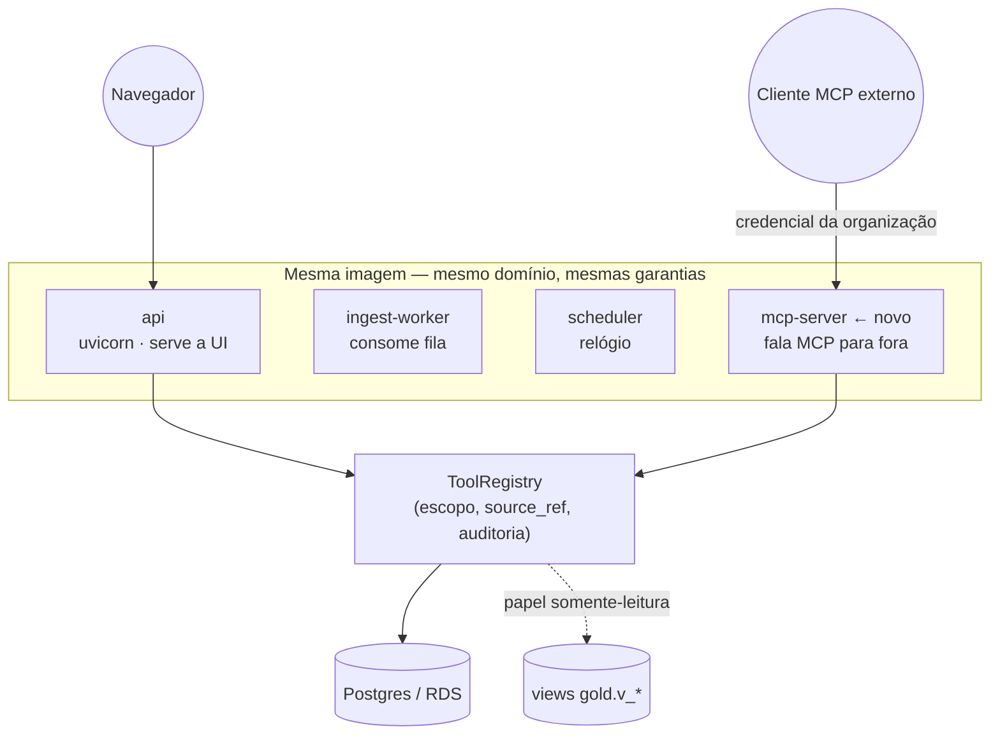

# MCP e inteligência na plataforma — plano de construção

> **O que este documento é:** o plano para elevar a IA da plataforma de um assistente de
> janela fixa (uma tela, seis indicadores) para uma **camada de ferramentas governada**,
> exposta por MCP, que qualquer parte do produto — e qualquer cliente externo autorizado —
> pode usar sem nunca perder rastreabilidade, escopo ou fidedignidade.
>
> **Vive em** `backend_plataforma_fiscal/docs/` e é versionado com o código, como o
> `evolucao_plataforma.md`. As fichas de sprint seguem o mesmo formato daquele documento.
>
> **Iniciado em:** 2026-08-12 · **Estado:** IA-1a **em produção** (backend `79bfd52`,
> migration `0043`); IA-1b **implementada** (catálogo com 14 ferramentas, incluindo a
> consulta guiada da §6.1 — sem migration); IA-2 em diante, planejadas.
> **Premissa inegociável:** é plataforma de governo. Um número errado com aparência de
> certeza é pior que a ausência do número. Todo o desenho abaixo parte disso.

---

## 1. Onde a IA está hoje (medido, não estimado)

A Sprint 17 entregou um RAG fundamentado e correto **para o escopo que ela definiu**. O
problema não é qualidade — é **alcance**. Levantamento no código e no banco:

| O que | Medido | Onde |
|---|---|---|
| Indicadores que o assistente consegue enxergar | **6 famílias** (`rcl`, `pessoal_executivo`, `divida_consolidada_liquida`, `resultado_primario`, `saude_asps`, `educacao_mde`) + benchmark e calendário | `reports/service.py` (códigos emitidos por `build_document`) |
| Como ele decide o que recuperar | Dicionário fixo de **17 palavras-chave** → indicador | `assistant/retriever.py:30-53` |
| Contexto por tela | Mapa fixo de **8 rotas** | `assistant/retriever.py:71-80` |
| Tabelas no schema `gold` | **93** | banco de produção |
| Tabelas em `silver` / `bronze` / `op` | 19 / 22 / 22 | banco de produção |
| Códigos distintos em `gold.mart_indicador` | **10** (23.270 linhas) | banco de produção |
| Fontes de dado catalogadas | **21** | `gold.catalogo_fonte` |
| Arestas de linhagem | **121** | `gold.lineage_edge` |

**A consequência concreta:** `garantias`, `operacoes_credito`, `investimento_rcl`,
`fundeb_profissionais` e `rcl_per_capita` existem no mart, estão em produção, aparecem em
tela — e **nunca chegam ao contexto do assistente**, porque não há palavra-chave que os
alcance. Receita, Despesa, Patrimônio/MSC, Restos a Pagar, Projeções, Alertas, Qualidade e
Cobertura não têm nenhuma representação no que a IA consegue ler. O gestor pode perguntar
"como está minha dívida?" e receber resposta fundamentada; se perguntar "e as garantias
concedidas?", o assistente não tem como saber que a plataforma sabe.

Isso **não é defeito de implementação** — é o teto de um desenho em que o conjunto de
fatos é escolhido *antes* da pergunta. É exatamente esse teto que a camada de ferramentas
remove: o modelo deixa de receber um pacote pré-montado e passa a **pedir o que precisa**,
dentro de um contrato que o backend controla.

### 1.1 O que já está certo e deve ser preservado inteiro

Nada abaixo se joga fora. Estes são os ativos que o novo desenho herda:

- **Porta `LLMProvider`** (`assistant/llm.py:123-130`) — o domínio nunca importa SDK de
  provedor. Trocar Gemini por outro modelo é trocar um adaptador.
- **Contexto estruturado, não texto solto** (`FatoContexto`/`NormaContexto`,
  `assistant/llm.py:65-91`) — o provedor recebe dado tipado com `source_ref`, não uma
  string pré-formatada. É a fundação de tudo que vem a seguir.
- **Recusa honesta sem chamar o modelo** (`assistant/service.py:239-287`) — sem dado e sem
  norma, a resposta é a recusa, e o LLM nem é acionado. Não existe caminho em que o modelo
  seja convidado a preencher um vazio.
- **As seis regras invioláveis do prompt** (`assistant/service.py:53-68`) — nunca número de
  memória, fonte por número, separar "calculado do seu dado" de "explicação da norma",
  sinalizar lacuna, considerar esfera, não emitir parecer definitivo.
- **Degradação com erro claro** — falha do provedor vira `LLMProviderError` (RFC 7807),
  nunca resposta sem fonte.
- **Auditoria e cota por organização** — `op.conversa`, `op.conversa_uso`, `op.audit_log`.

---

## 2. A decisão de arquitetura, e por que MCP

### 2.1 O problema real a resolver

Se a IA vai deixar de ser uma página e virar uma capacidade da plataforma, cada lugar que
a usar precisa das **mesmas** garantias: escopo do ente, licença, `source_ref`, `as_of`,
auditoria. Implementar isso em cada ponto de uso é garantir que um deles vai divergir — foi
exatamente o que a Sprint E1 encontrou em `GET /ingestao/data`, que exigia capacidade mas
não chamava `assert_ente_in_scope`, e por isso furava o gate de **licença** sem furar o de
dado (§A22 do `evolucao_plataforma.md`).

A lição daquele achado vale integralmente aqui, e é o princípio de desenho número um:

> **A garantia mora dentro da ferramenta, não na borda que a chama.** Uma ferramenta que
> só é segura quando invocada pelo caminho HTTP "certo" é uma ferramenta insegura.

### 2.2 A escolha: uma camada de ferramentas, exposta duas vezes

MCP (Model Context Protocol) padroniza como um cliente de IA descobre e chama ferramentas
e lê recursos. É a escolha certa para o **exterior** — clientes MCP, agentes que a SEFAZ
venha a adotar, integrações futuras — porque padroniza descoberta, tipagem e permissão.

Mas há um fato de engenharia que precisa estar dito com todas as letras, porque muda o
plano: **o Gemini, via `google-genai`, não fala MCP nativamente.** O assistente interno da
plataforma usa *function calling* do próprio SDK. Se construíssemos "um servidor MCP" e
depois quiséssemos IA nas outras telas, acabaríamos com duas implementações das mesmas
ferramentas — e elas divergiriam, como sempre divergem.

Por isso o desenho é:

**A regra que sustenta o desenho:** as exposições são adaptadores burros. Toda validação de
escopo, licença, `as_of`, limite de linhas e auditoria acontece **dentro** da ferramenta.
Trocar MCP por outro protocolo amanhã não move uma linha de regra.

### 2.3 O que é ferramenta e o que é recurso

MCP distingue *tools* (ações que o modelo invoca) de *resources* (conteúdo que o cliente
carrega no contexto). A distinção importa aqui:

| Tipo | Conteúdo | Exemplo |
|---|---|---|
| **Resource** | O que não muda por pergunta: dicionário de dados, catálogo de fontes, glossário fiscal, mapa de linhagem | "o que é RCL Ajustada", "quais fontes alimentam a página de Dívida" |
| **Tool** | O que exige consulta com escopo e devolve número | "indicador X do ente Y no período Z", "drill de despesa por função", "rodar esta consulta analítica" |

Um erro comum é transformar dicionário em ferramenta (o modelo gasta uma chamada para
descobrir o que já podia estar no contexto) ou transformar consulta em recurso (perde
escopo e auditoria). A separação acima é deliberada.

---

## 3. A camada semântica — e o que já existe dela

Você perguntou se seria preciso um dicionário de dados. **Sim — e cerca de metade já
existe**, espalhada. O trabalho não é criar do zero, é unificar e completar:

| Peça | Estado | Onde vive hoje |
|---|---|---|
| Catálogo de fontes (família, cadência, órgão, URL, páginas impactadas, dependências) | ✅ **Existe** — 21 fontes | `gold.catalogo_fonte`, alimentado por `connectors/registry.py::FONTE_META` |
| Mapa de linhagem (fonte → tabela → indicador → página) | ✅ **Existe** — 121 arestas | `gold.lineage_edge`, `quality/lineage_seed.py` |
| Limites legais por esfera (teto, alerta, prudencial, sentido) | ✅ **Existe** — 16 linhas, como **dado**, não código | `gold.dim_limite_legal` |
| Glossário de contas PCASP | ✅ **Existe** — 3.555 contas | `accounting/pcasp_glossario.py` (Sprint D1) |
| Corpo normativo vetorizado (LRF, CF, MDF) | ✅ **Existe** | `gold.norma_chunk`, `assistant/norma_seed.py` |
| Cobertura por fonte/página (o que a plataforma **não** tem) | ✅ **Existe** | `gold.mart_cobertura_fonte`, `coverage/service.py` |
| **Definição de indicador** (fórmula, base legal, denominador, unidade, sentido) | ❌ **Falta** | — |
| **Descrição de coluna** (o que é `valor_pct_rcl` × `base_valor` × `denominador`) | ❌ **Falta** | — |
| **Caminhos de junção** (como ir de `mart_indicador` a `dim_ente` a `fato_pessoal`) | ❌ **Falta** | — |
| **Vocabulário de negócio → esquema** ("gasto com pessoal" → `indicador='pessoal_executivo'`) | ❌ **Falta** | — |

As quatro lacunas são precisamente o que separa "a IA lê o banco" de "a IA entende o
banco". Sem elas, uma consulta SQL gerada por modelo escolhe a coluna errada com sintaxe
perfeita — o modo de falha mais caro que existe num sistema fiscal, porque **parece certo**.

Exemplo concreto do risco, tirado do próprio acervo: `gold.mart_indicador` tem
`valor_rs`, `valor_pct_rcl`, `base_valor` e `denominador`. A Sprint 28 descobriu que o
denominador dos limites era a RCL cheia onde deveria ser a RCL Ajustada — um erro que
custou uma migration corretiva. Um modelo sem dicionário reproduz esse erro em toda
consulta que gerar, e ninguém revisa o SQL de uma resposta em linguagem natural.

---

## 4. Onde mais a IA entra (as sugestões pedidas)

Cada item abaixo reusa capacidade que **já existe** no backend — nenhum exige cálculo
fiscal novo. Ordenados por razão valor/esforço:

| # | Capacidade | O que reusa | Por que vale |
|---|---|---|---|
| 1 | **"Explique este número"** em qualquer tela | `lineage_edge` + memória de cálculo + `source_ref` (já em toda resposta) | Transforma rastreabilidade que já existe em explicação legível. É a maior entrega por menor esforço da lista |
| 2 | **Explicação da fila de alertas** (a *ordenação* continua determinística) | `op.alerta`, `alerts/rules.py`, `dim_providencia_legal` | Fila com 40 alertas não é informação. Mas priorizar é regra, não redação: a ordem sai de `alerts/rules.py`, auditável e reproduzível; o LLM **explica** por que o primeiro é o primeiro e qual é a providência legal. Deixar o modelo ordenar seria trocar uma regra conferível por um julgamento que ninguém consegue revisar |
| 3 | **Narrativa do relatório** | `reports.build_document` (já monta o documento inteiro) | O relatório já tem todos os números com fonte; falta a prosa que liga um ao outro |
| 4 | **Busca em linguagem natural na Central de Dados** | `catalogo_fonte`, `mart_cobertura_fonte`, `data_quality_check` | "Por que a página de Saúde está vazia para meu município?" é uma pergunta de operação, e a resposta já é dado |
| 5 | **Copiloto de comparação** | `mart_benchmark`, `dim_coorte` | Comparar com coorte é a pergunta natural depois de ver o próprio número |
| 6 | **Explicação de anomalia de ingestão** | `quality/checks.py` (9 checks), `ingestion_log` | O check já sabe que divergiu; falta dizer o que isso significa para quem vai agir |
| 7 | **Consulta analítica livre (SQL governado)** | — (novo, Sprint IA-4) | O teto mais alto e o risco mais alto. Última da fila de propósito |

Não entram nesta lista, deliberadamente: **qualquer uso de IA que gere número**. Projeção
continua sendo `forecast/` (modelo estatístico auditável, com intervalo de confiança);
classificação de conta continua sendo regra determinística. IA compõe, explica e navega —
não calcula e não decide prioridade.

### 4.1 "Ler todas as fontes" precisa de uma ressalva

O pedido original foi que o MCP conseguisse ler **todas** as fontes de dados. Do jeito
literal, isso quebra o desenho medallion. A leitura correta, por camada:

| Camada | A IA pode ler? | Por quê |
|---|---|---|
| `gold` | ✅ **Sim, é a fonte de resposta** | Dado calculado, versionado, com `source_ref`. É o que a tela mostra |
| `silver` | ⚠️ **Sim, para procedência** — não para responder número | Normalizado mas não conciliado; responder por ele é responder um número que a plataforma não endossa |
| `bronze` | ❌ **Não como fonte de resposta** | É o payload cru da fonte, sem vigência resolvida. A IA pode dizer *que existe* (hash, data, versão) — nunca extrair valor dele |
| `op` | ❌ **Nunca em consulta livre** | Dado da organização. As ferramentas de alerta/relatório acessam o que o principal já pode ver, pelo caminho normal; consulta livre não entra aqui |

Responder por `bronze` seria contornar justamente as camadas que existem para impedir que
um número não conciliado chegue ao gestor.

---

## 5. Guardrails — o que "fidedigno" significa em contrato

Sete camadas, cada uma com falha independente. Todas verificáveis por teste.

| # | Guardrail | Como se materializa |
|---|---|---|
| G1 | **Número nunca vem do modelo** | Ferramenta devolve valor tipado + `source_ref`; o modelo só compõe prosa em volta. Nenhuma ferramenta aceita número como entrada para "conferir" |
| G2 | **Escopo e licença dentro da ferramenta** | Todo tool que recebe ente chama `assert_ente_in_scope` no próprio corpo — nunca confia na borda (lição A22/E1) |
| G3 | **Recusa preservada** | Sem dado e sem norma ⇒ recusa honesta sem acionar o modelo. O caminho de recusa da Sprint 17 é herdado, não reescrito |
| G4 | **`source_ref` obrigatório na saída** | Contrato de retorno de toda ferramenta que devolve número fiscal carrega relatório, anexo, período e `versao_entrega` (§6.3) |
| G5 | **Bitemporalidade respeitada** | `as_of` é parâmetro de primeira classe em toda ferramenta de leitura; sem ele, versão vigente. Resposta declara qual usou |
| G6 | **Verificação de saída (pós-geração)** | Todo número citado na prosa é casado contra os valores devolvidos pelas ferramentas daquela conversa; número sem lastro é sinalizado, não publicado em silêncio. Estende o casamento tolerante da Sprint B3 (`RespostaMarkdown.tsx`) para o lado do servidor |
| G7 | **Auditoria completa da cadeia** | Cada chamada de ferramenta grava principal, argumentos, linhas devolvidas, duração e `conversa_id` — a pergunta "como a IA chegou nisso?" tem resposta consultável, não reconstituída |

**Sobre G6, que é o mais subestimado:** guardrail de *prompt* é pedido; guardrail de
*verificação* é garantia. Um sistema de governo precisa dos dois, e o segundo é o que
sobrevive a uma troca de modelo.

---

## 6. Sprints

Seis sprints. As três primeiras são fundação e devem ser feitas em ordem; IA-5 e IA-6
podem correr em paralelo depois da IA-3. **IA-4 (SQL) é deliberadamente a última das de
plataforma** — só faz sentido quando o dicionário (IA-2) já estiver maduro, porque é ele
que impede a consulta sintaticamente perfeita e semanticamente errada.

### 6.1 Antes de aprovar a IA-4: a alternativa que talvez a dispense

A IA-4 (SQL livre) é a sprint de maior risco do plano. Existe um caminho intermediário que
entrega a maior parte do valor com uma fração do risco, e ele deve ser avaliado **antes**:

**Consulta guiada — catálogo parametrizado.** Em vez de o modelo escrever SQL, ele escolhe
uma consulta de um catálogo curado e preenche os parâmetros. Cada consulta é SQL escrito
por gente, revisado, testado e versionado; o modelo só decide *qual* usar e *com quais
valores*. Exemplos que cobrem a pergunta do §IA-4:

| Consulta do catálogo | Parâmetros |
|---|---|
| `entes_que_ultrapassaram_faixa` | indicador, faixa, período inicial/final, UF, faixa populacional |
| `ranking_indicador_na_coorte` | indicador, coorte, período, ordem |
| `serie_do_indicador_por_ente` | indicador, entes, período inicial/final |
| `entes_sem_entrega_da_fonte` | fonte, período |

**O que isso ganha:** o SQL é auditável antes de rodar (não depois), a vigência está
sempre correta porque quem escreveu sabia do A14, o plano de execução é previsível, e a
superfície de ataque é zero — não há string de SQL vinda do modelo.

**O que isso perde:** a cauda longa. Pergunta fora do catálogo vira "não sei" — mas vira
*"não sei, e este é o catálogo do que sei responder"*, que é uma recusa útil.

**Recomendação honesta:** implementar a consulta guiada como parte da IA-1/IA-2, medir por
`op.ia_tool_call` quantas perguntas reais caem fora do catálogo, e **só então** decidir se
a IA-4 se justifica. Numa plataforma de governo, "80% das perguntas com risco zero" quase
sempre vence "100% das perguntas com risco de número errado assinado pela instituição".

---

> **Correção de sequenciamento (2026-08-12), antes da primeira linha de código.** A IA-1
> como planejada entregava 10 ferramentas + envelope + auditoria **sem nenhum consumidor** —
> o primeiro resultado visível só apareceria na IA-3, três sprints adiante, e uma surpresa
> na integração com *function calling* só apareceria lá. Trocada por uma **fatia vertical**:
> a IA-1a atravessa a arquitetura inteira com duas ferramentas e já liga uma no assistente;
> a IA-1b amplia o catálogo, que vira trabalho mecânico depois que o contrato está provado.
> O total de trabalho é o mesmo; o que muda é quando o risco aparece.

### Sprint IA-1a — Fatia vertical: envelope, duas ferramentas e o primeiro consumo

**Objetivo:** provar a arquitetura inteira de ponta a ponta com o menor escopo possível —
envelope de execução, duas ferramentas e uma delas já sendo chamada pelo assistente via
*function calling* — de modo que tudo que pode dar errado apareça nesta sprint, não na
terceira.

**Problema:** o mesmo do §1 (o assistente enxerga 6 famílias de indicador por dicionário de
palavras-chave), atacado pela ponta mais fina.

**Justificativa:** o risco desta iniciativa não está em escrever 10 ferramentas — está em
descobrir tarde que o envelope não sustenta escopo, que o `source_ref` se perde no caminho
até a resposta, ou que o *function calling* do Gemini não conversa bem com o registro. Uma
fatia fina responde as três perguntas de uma vez.

**Tarefas:**
- `shared/tooling/` com `Tool` (nome, descrição, JSON Schema de entrada/saída, capacidade
  RBAC exigida, se recebe ente) e `ToolRegistry`.
- Envelope `invoke()`: valida entrada; **verifica escopo e licença** quando há ente
  (chamando `assert_ente_in_scope`, sem reimplementar); aplica `as_of`; cronometra; grava
  auditoria; valida a saída — inclusive a presença de `source_ref` quando há número fiscal.
- Duas ferramentas, reusando serviço existente (zero cálculo novo):
  `indicador_do_ente` e `linhagem_do_indicador`.
- Migration aditiva e reversível para `op.ia_tool_call`.
- Adaptador de *function calling* atrás da porta `LLMProvider` já existente, ligando
  `indicador_do_ente` ao assistente — o domínio continua sem importar SDK.

**Riscos:** regressão silenciosa dos guardrails da Sprint 17. Mitigação: a suíte de
guardrails existente roda contra o caminho novo **sem afrouxar nenhuma asserção**.

**Critérios de aceite:**
- Ferramenta com ente fora da carteira ⇒ 403 de escopo; ente sem licença ⇒ 403 de licença —
  os dois estados distinguíveis, como na E1.
- Saída com número fiscal sem `source_ref` é rejeitada **pelo envelope**, não por convenção.
- Toda chamada (inclusive a que falha) aparece em `op.ia_tool_call` com principal,
  argumentos e duração.
- Perguntar sobre **garantias** — hoje inalcançável (§1) — passa a ter resposta fundamentada.
- Sem dado e sem norma, a recusa honesta continua acontecendo **sem** chamar o modelo.

**Testes:** matriz de escopo (dentro/fora da carteira, com/sem licença); `source_ref`
ausente rejeitado; auditoria registra falha; `as_of` retroativo devolve a versão de então;
guardrails da Sprint 17 reexecutados contra o caminho novo.

**Evidências:** captura de `op.ia_tool_call` após uma bateria de chamadas; transcrição de
uma pergunta sobre garantias com a cadeia de ferramenta e o `source_ref` de cada número.

#### Entregue (2026-08-12)

| Peça | Onde |
|---|---|
| `Tool`/`ToolRegistry` com validação **na carga** | `src/app/shared/tooling/base.py` |
| Envelope `invoke()` (capacidade → escopo/licença → entrada → `as_of` → execução → saída → auditoria) | `src/app/shared/tooling/envelope.py` |
| Guarda estrutural de `source_ref` (G4) | `src/app/shared/tooling/fonte.py` |
| `indicador_do_ente` e `linhagem_do_indicador` | `src/app/shared/tooling/catalogo.py` |
| `op.ia_tool_call` (aditiva, com RLS) | `alembic/versions/0043_ia_tool_call.py` |
| Porta de *function calling* (`ToolSpec`, `ToolCallingProvider`, `schema_para_provedor`) + laço no adaptador Gemini | `src/app/modules/assistant/llm.py` |
| Alcance do assistente derivado de `ROTULOS` em vez de dicionário fixo | `assistant/retriever.py::indicadores_nomeados` |
| 31 testes (matriz de escopo parametrizada sobre o registro, fonte ausente, auditoria da falha, `as_of` retroativo) | `tests/test_ia_tooling.py` |

Três decisões que só apareceram na implementação, registradas por serem contraintuitivas:

1. **A auditoria grava em transação própria.** O caminho que mais importa auditar é o que
   falha — e é o que se perderia, porque a exceção sobe até o handler e o `get_db` faz
   *rollback* da sessão da requisição, levando junto a linha de auditoria. No caminho de
   sucesso a auditoria é condição de entrega (falha nela ⇒ falha a chamada); no de falha,
   ela é registrada e nunca mascara o erro original.
2. **`extra='forbid'` na entrada de toda ferramenta.** Ignorar um argumento inventado pelo
   modelo (`exercicio=2023` numa ferramenta que só entende `periodo`) produz número certo
   respondendo a pergunta que ninguém fez — o pior modo de falha possível aqui.
**Em produção desde 2026-08-13** (backend `79bfd52`, migration `0043` aplicada em passo
isolado com exit 0, `/health` 200). A verificação independente encontrou **dois defeitos
alheios a esta sprint**, ambos meus e de sprints anteriores do mesmo dia, corrigidos junto:
o teste de auditoria da H1 comparava data local com carimbo UTC (reprovava todo dia depois
das 21h) e a eleição do veredito vigente da E1 desempatava por `uuid4()` — os dois estão
registrados em detalhe no §11 do `evolucao_plataforma.md`. **É o argumento da fatia
vertical se pagando:** atravessar a arquitetura inteira cedo expôs fragilidades que
ferramenta nenhuma isolada teria tocado.

3. **A fonte vem da linha do mart, não do detalhe do Monitor de Limites.**
   `limits.build_limite_detail` carimba `RREO/Anexo 03` em todo indicador, porque é dali
   que sai a RCL do denominador. Para `garantias` e `operacoes_credito`, apurados do
   **RGF**, isso erra a procedência com aparência de rigor. A ferramenta prefere o
   `source_ref` gravado na materialização. **O endpoint `GET /entes/{ibge}/limites/{ind}`
   continua com o carimbo antigo** — é defeito aberto, fora do escopo desta sprint.

---

### Sprint IA-1b — Ampliação do catálogo de ferramentas

**Objetivo:** com o contrato provado pela IA-1a, levar o catálogo às demais capacidades —
trabalho mecânico e paralelizável, sem decisão de arquitetura nova.

**Tarefas:** `serie_historica`, `limites_do_ente`, `drill_receita`, `drill_despesa`,
`cobertura_do_ente`, `qualidade_do_ente`, `alertas_do_ente`, `comparar_com_coorte`; mais a
**consulta guiada** (catálogo parametrizado da §6.1), que é o que pode dispensar a IA-4.

**Critérios de aceite:** cada ferramenta nova passa pela mesma matriz de escopo da IA-1a
(o teste é parametrizado sobre o registro — ferramenta nova entra na matriz sozinha);
nenhuma introduz cálculo fiscal fora de `indicators/`.

#### Entregue (2026-08-13)

O catálogo saiu de **2** ferramentas para **14**: as oito da ficha mais as quatro consultas
guiadas da §6.1.

| Peça | Onde |
|---|---|
| `serie_historica`, `limites_do_ente`, `drill_receita`, `drill_despesa`, `cobertura_do_ente`, `qualidade_do_ente`, `alertas_do_ente`, `comparar_com_coorte` | `src/app/shared/tooling/ferramentas.py` |
| Consulta guiada: `entes_que_ultrapassaram_faixa`, `ranking_indicador_na_coorte`, `serie_do_indicador_por_ente`, `entes_sem_entrega_da_fonte` | `src/app/shared/tooling/consultas.py` |
| Período-âncora, ausência declarada e memória-como-texto, compartilhados pelos três módulos | `src/app/shared/tooling/comum.py` |
| `fonte_gravada` — a regra "a fonte da materialização manda" promovida a compartilhada | `src/app/shared/source_ref.py` |
| `declara_fonte` — a guarda de carga passou a aceitar `source_ref` **por item** | `src/app/shared/tooling/base.py` |
| `limits.serie_historica` pública, com `as_of` e com a entrega de cada ponto | `src/app/modules/limits/service.py` + `schemas.py` |
| 23 testes de consulta guiada (vigência, matriz de escopo parametrizada, contenção, auditoria) | `tests/test_ia_consultas.py` |
| Matriz de escopo estendida a 9 ferramentas com ente + 5 testes de procedência por item | `tests/test_ia_tooling.py` |

Sem migration: a sprint não criou tabela — as ferramentas leem o que já está materializado.

**Cinco decisões que só apareceram na implementação, registradas por serem contraintuitivas:**

1. **A vigência é resolvida pelo *join*, não por um filtro.** Toda consulta guiada parte de
   `entregas_vigentes()`, que devolve **uma** `versao_entrega` por `(ente, período)`, e junta
   o fato por essa chave composta. A diferença em relação a "filtrar `vigente = true` no
   fim" é que aqui uma versão superada **não tem como entrar** — não existe chave para ela
   casar. É a forma estrutural do que o A14/A15 custou duas sprints para corrigir, e é o
   que o teste `test_consulta_nao_conta_versao_superada` fixa: o cenário tem um ente que
   estourou o limite de pessoal na entrega superada (56,20%) e não estourou na vigente
   (48,10%); a consulta devolve **só** o vizinho que estourou de verdade.

2. **Escopo agregado × nominal, aplicado num funil só.** As consultas guiadas atravessam
   entes, então não recebem `ente` e o gate do envelope (que só age sobre `EnteToolInput`)
   não as alcança. A garantia foi para `consultas.executar()`: consulta **agregada** é
   restringida ao conjunto licenciado; consulta **nominal** (o usuário nomeou os entes)
   *afirma* o escopo com `assert_ente_in_scope`, preservando a distinção entre os dois 403.
   Omitir em silêncio um ente que o gestor nomeou seria responder outra pergunta. Para que
   isso não dependa de disciplina, o executor recebe um `Escopo` já resolvido como
   argumento obrigatório: uma consulta nova **não consegue** rodar sem escopo.

3. **`source_ref` por item, e a guarda de carga teve de mudar para isso.** A IA-1a exigia
   `source_ref` na raiz da saída. Está certo para o drill (a árvore inteira vem de uma
   entrega), mas errado para a série histórica (um período por entrega) e para a lista de
   limites (`garantias` vem do RGF, a dívida do RREO). Um carimbo único na raiz produziria
   procedência **uniforme e errada** — pior que nenhuma, porque erra com aparência de rigor.
   `declara_fonte` passou a aceitar a fonte declarada no tipo do item da lista; a guarda de
   runtime continua conferindo número a número, sem afrouxar nada.

4. **Contagem de entidade não é número fiscal.** `entes_no_escopo`, `entes_com_dado` e os
   contadores de alerta por severidade entraram em `CHAVES_ESTRUTURAIS`. A defesa: eles
   contam *entes* e *alertas*, nunca reais, e não existe `versao_entrega` que os fundamente —
   exigir `source_ref` aí obrigaria a inventar uma procedência. Na mesma linha, dois casos
   passaram a viajar como **texto**: a memória de cálculo dos alertas e os dois lados do
   check `freshness`, que mede *dias de atraso* e não se ancora em entrega nenhuma. Um
   número sem fonte que o modelo citaria como fato apurado é exatamente o que a G4 existe
   para impedir.

5. **Não existe uma ferramenta `listar_consultas`.** O catálogo já viaja no contexto como a
   própria lista de ferramentas; transformá-lo numa chamada gastaria um passo do agente
   para descobrir o que já estava disponível — o erro descrito na §2.3 (dicionário virando
   ferramenta). A recusa útil da §6.1 ("não sei, e este é o catálogo do que sei responder")
   sai de graça. Pelo mesmo motivo, cada consulta é uma **ferramenta própria** em vez de um
   `consulta_guiada(nome, parametros)`: assim cada uma leva o seu JSON Schema ao modelo e o
   `extra='forbid'` age sobre os parâmetros reais, em vez de devolver a validação ao runtime.

**Fronteira respeitada.** Nenhuma linha nova soma, divide ou classifica valor fiscal. O
ranking **ordena** e não calcula percentil de propósito: percentil e distribuição já são
`benchmark/` (expostos por `comparar_com_coorte`), e recalculá-los aqui criaria uma segunda
régua para o mesmo número — o que a §7 do `CLAUDE.md` proíbe.

**Defeito herdado, ainda aberto.** `limits.build_limite_detail` continua sem repassar o
`as_of` à série histórica que devolve: o detalhe de uma consulta retroativa traz o número
do período no `as_of` pedido, mas a série sempre nas versões vigentes de hoje. A função
agora aceita o parâmetro (a ferramenta `serie_historica` o usa); mudar o comportamento do
endpoint `GET /entes/{ibge}/limites/{ind}` ficou fora do escopo desta sprint, como o
carimbo de fonte daquele mesmo endpoint ficou fora da IA-1a.

**O que isto significa para a IA-4.** As quatro consultas cobrem as perguntas do §6.1,
inclusive a que a ficha da IA-4 usa como exemplo ("quais municípios acima de 50 mil
habitantes ultrapassaram o prudencial de pessoal em 2024" — é
`entes_que_ultrapassaram_faixa` com `populacao_minima`). A medição que decide a IA-4 já
está instrumentada: `op.ia_tool_call` registra toda chamada, e o que cair fora do catálogo
aparece lá como nome inventado (404 auditado). **A recomendação da §6.1 permanece: medir
antes de aprovar a IA-4.**

---

### Sprint IA-1 (referência) — a camada completa

**Objetivo:** criar o registro único de ferramentas — tipadas, com escopo, `source_ref` e
auditoria embutidos — sem nenhuma dependência de protocolo ou de provedor de IA. **Executada
como IA-1a + IA-1b acima**; mantida aqui como referência do escopo total.

**Problema:** hoje a única forma de a IA obter dado é o pacote fixo montado por
`retriever.build_context`, com seis famílias de indicador escolhidas por palavra-chave
(`retriever.py:30-53`). Qualquer capacidade nova (drill, comparação, cobertura, alerta)
exigiria estender esse pacote, e o pacote cresce até virar o contexto inteiro da
plataforma em toda pergunta — caro, lento e ruidoso.

**Justificativa:** é a peça que impede a duplicação anunciada no §2.2. Sem ela, o servidor
MCP e o agente interno implementam ferramentas separadamente e divergem no primeiro mês.

**Tarefas:**
- `shared/tooling/` com `Tool` (nome, descrição, esquema de entrada/saída em JSON Schema,
  capacidade RBAC exigida, se toca ente) e `ToolRegistry`.
- Execução envelopada: toda chamada passa por um `invoke()` que (a) valida entrada contra o
  esquema, (b) resolve e **verifica escopo/licença** quando há ente, (c) aplica `as_of`,
  (d) cronometra, (e) grava auditoria, (f) valida a saída contra o esquema — incluindo a
  presença de `source_ref` quando a saída tem número fiscal.
- Primeiro lote de ferramentas, todas reusando serviço existente (zero cálculo novo):
  `indicador_do_ente`, `serie_historica`, `limites_do_ente`, `drill_receita`,
  `drill_despesa`, `cobertura_do_ente`, `qualidade_do_ente`, `alertas_do_ente`,
  `comparar_com_coorte`, `linhagem_do_indicador`.
- Tabela `op.ia_tool_call` (auditoria de chamada) com migration aditiva e reversível.

**Riscos:** o envelope de execução virar um segundo lugar onde regra de escopo mora,
divergindo de `shared/scope.py`. Mitigação: o envelope **chama** `assert_ente_in_scope`, não
reimplementa; teste garante que uma ferramenta nova sem declaração de escopo não registra.

**Critérios de aceite:**
- Nenhuma ferramenta consegue ser registrada sem declarar se recebe ente e qual capacidade
  exige (falha na carga, não em runtime).
- Chamada de ferramenta com ente fora da carteira devolve 403 de escopo; ente sem licença,
  403 de licença — os dois estados distinguíveis, como na E1.
- Toda saída com número fiscal carrega `source_ref` — validado pelo próprio envelope, não
  por convenção.
- 100% das chamadas aparecem em `op.ia_tool_call` com principal, argumentos e duração.

**Testes:** matriz de escopo por ferramenta (dentro/fora da carteira, com/sem licença);
ferramenta sem `source_ref` na saída é rejeitada pelo envelope; auditoria registra também
a chamada que falhou; `as_of` retroativo devolve a versão de então, não a vigente.

**Evidências:** tabela das 10 ferramentas com entrada/saída e a captura de `op.ia_tool_call`
após uma bateria de chamadas.

---

### Sprint IA-2 — Dicionário semântico

**Objetivo:** dar à IA o significado do dado, não só o dado — unificando o que já existe
(§3) e preenchendo as quatro lacunas identificadas.

**Problema:** `gold.catalogo_fonte`, `gold.lineage_edge`, `dim_limite_legal`,
`pcasp_glossario` e `mart_cobertura_fonte` já descrevem partes do acervo, mas nenhum
descreve **o indicador** (fórmula, base legal, denominador correto, sentido piso × teto)
nem **a coluna** (`valor_pct_rcl` × `base_valor` × `denominador` em `mart_indicador`). Sem
isso, qualquer geração de consulta escolhe coluna plausível e errada — e o §3 mostra que
esse erro exato já custou uma migration corretiva na Sprint 28.

**Justificativa:** é o guardrail que age *antes* da falha, não depois. E é pré-requisito
duro da IA-4: SQL governado sem dicionário é SQL adivinhado com permissão.

**Tarefas:**
- `gold.dicionario_indicador`: código, rótulo de negócio, definição, fórmula legível,
  **denominador correto**, unidade, sentido (piso/teto), base legal, tabela/coluna de
  origem, sinônimos de negócio. Semeado a partir de `dim_limite_legal` + `indicators/` +
  o que as fichas do `evolucao_plataforma.md` já registram.
- `gold.dicionario_campo`: schema, tabela, coluna, descrição, unidade, se é chave, se é
  seguro para consulta livre, armadilhas conhecidas ("esta coluna é devedor líquido, com
  sinal").
- `gold.dicionario_juncao`: caminhos de junção sancionados entre as tabelas consultáveis —
  o que impede o modelo de inventar um `JOIN` que multiplica linha.
- Exposição como **recursos MCP** (não ferramentas) e como bloco de contexto do agente
  interno.
- Teste de completude: toda tabela marcada consultável tem 100% das colunas descritas;
  todo indicador em `mart_indicador` tem verbete. Falha se alguém adicionar coluna sem
  descrever — a mesma ideia de catraca usada na Sprint A0R.

**Riscos:** dicionário que envelhece em silêncio e passa a mentir — pior que não existir.
Mitigação: a catraca acima transforma "esqueci de documentar" em suíte vermelha, e o
verbete guarda a data e a fonte da definição.

**Critérios de aceite:**
- Todo código presente em `gold.mart_indicador` tem verbete com fórmula e base legal.
- Toda coluna de tabela consultável tem descrição; nenhuma tabela de `op` é marcada
  consultável.
- Perguntar "o que é RCL Ajustada e por que ela é o denominador do limite de pessoal?"
  recebe resposta correta **sem** o modelo recorrer a conhecimento próprio — provado por
  teste com provedor determinístico.

**Testes:** catraca de completude (indicador e coluna); nenhum verbete aponta para tabela
inexistente; sinônimo de negócio resolve para o código certo; nenhuma tabela `op` marcada
como consultável.

**Evidências:** verbete completo de dois indicadores (um teto, um piso) e a saída da
catraca antes/depois.

---

### Sprint IA-3 — Servidor MCP e agente interno sobre o mesmo registro

**Objetivo:** expor a camada da IA-1 por MCP para clientes externos autorizados **e**
religar o assistente interno para usar o mesmo registro via *function calling* — provando,
com as duas exposições no ar, que a regra vive num lugar só.

**Problema:** o assistente hoje monta contexto antes da pergunta (§1). Com ferramentas, ele
passa a pedir o que precisa — e a resposta deixa de ser limitada pelo que o
`_KEYWORD_INDICADOR` previu.

**Justificativa:** é o ponto em que o trabalho vira produto. Também é o ponto de maior
risco de regressão do que já funciona, por isso as garantias da Sprint 17 são critério de
aceite explícito, não consequência esperada.

**Tarefas:**
- Servidor MCP expondo ferramentas (IA-1) e recursos (IA-2), com autenticação por
  credencial de organização, escopo por licença e o mesmo `op.ia_tool_call` de auditoria.
- Adaptador de *function calling* que converte o registro em declarações do
  `google-genai`, atrás da porta `LLMProvider` já existente — o domínio continua sem
  importar SDK.
- Laço de agente com **teto de passos** e orçamento de tokens; estouro degrada para
  resposta parcial declarada, nunca para resposta inventada.
- G6 (verificação de saída) no servidor: número na prosa sem lastro nas ferramentas
  daquela conversa é sinalizado.
- Preservar `op.conversa`, `op.conversa_uso`, cota mensal e a recusa honesta.

**Riscos:** (a) regressão silenciosa dos guardrails da Sprint 17 — mitigada por rodar a
suíte de guardrails existente contra o novo caminho, sem afrouxar nenhuma asserção;
(b) laço de agente custoso — mitigado pelo teto de passos e pela cota por organização que
já existe.

**Critérios de aceite:**
- Uma pergunta sobre `garantias` (hoje inalcançável, §1) recebe resposta fundamentada com
  `source_ref`.
- Cliente MCP externo autenticado como organização A não enxerga ente de B — matriz de
  isolamento no padrão da Sprint E1, com `== 404`/`403` conforme o caso.
- Provedor indisponível continua produzindo `LLMProviderError`, nunca resposta sem fonte.
- Sem dado e sem norma, a recusa honesta continua acontecendo **sem** chamar o modelo.
- Nenhuma resposta publica número que não veio de ferramenta.

**Testes:** guardrails da Sprint 17 reexecutados contra o caminho novo; isolamento
multi-tenant via MCP; teto de passos; verificação de saída com número forjado na prosa
(deve ser sinalizado); cota mensal respeitada.

**Evidências:** transcrição de uma conversa com a cadeia completa de chamadas de
ferramenta e o `source_ref` de cada número; captura do isolamento negando ente alheio.

---

### Sprint IA-4 — Consulta analítica governada (SQL)

**Objetivo:** permitir pergunta analítica arbitrária sobre o acervo fiscal **público**
(`gold`/`silver`) sem abrir o banco — com uma cadeia de contenção em que qualquer elo
sozinho já impede o dano.

**Problema:** existem perguntas legítimas que nenhuma ferramenta fixa cobre ("quais
municípios do Ceará com população acima de 50 mil ultrapassaram o prudencial de pessoal em
algum quadrimestre de 2024?"). Sem SQL, a resposta é "não sei" para uma pergunta que o
banco responde.

> ### ⚠️ A crítica que precisa ser lida antes de aprovar esta sprint
>
> **SQL livre reintroduz, por construção, a família de bug mais cara da plataforma.** Os
> achados A14 e A15 — *"versão que existe, vigência que não se declara"* — foram
> exatamente isto: leitura que somava versões superadas em vez de usar a vigente.
> Custaram duas sprints, uma migration corretiva e reprocessamento em produção.
>
> Um modelo escrevendo `SUM(valor_rs) FROM gold.mart_indicador ...` sem filtrar vigência
> **produz o A14 de novo**, com sintaxe impecável e resultado plausível. O gestor não
> revisa SQL embutido numa resposta em linguagem natural — é o pior modo de falha
> possível: silencioso, plausível e estável.
>
> Some-se a isso que o `CLAUDE.md` §7 é explícito: *"cálculos fiscais ficam em
> `indicators/` — outros módulos consomem, não recalculam"*. Uma agregação escrita por
> modelo é, por definição, um recálculo fora da fonte única de verdade.
>
> **Duas consequências de desenho, não negociáveis:**
> 1. **A IA consulta *views*, nunca tabelas de fato.** Ver a tarefa 1 abaixo.
> 2. **Antes de aprovar esta sprint, avalie a alternativa da §6.1 (consulta guiada)** —
>    que entrega ~80% das perguntas reais sem abrir superfície de SQL nenhuma.

**Justificativa:** é o maior salto de capacidade — e o maior risco do plano inteiro. Por
isso vem depois do dicionário, em sprint própria, com contenção em profundidade.

**Tarefas:**
- **Views de consulta, não tabelas** (`gold.v_*`): a allowlist da IA aponta **apenas** para
  views que já resolvem vigência, já aplicam `as_of` e já expõem `source_ref` como coluna.
  Uma consulta errada sobre uma view certa erra o recorte; uma consulta errada sobre a
  tabela crua ressuscita o A14. As tabelas de fato ficam fora do alcance do papel de
  leitura — não por convenção, por permissão.
- **Papel de banco somente-leitura** (`plataforma_ia_ro`): hoje não existe — as roles são
  `plataforma_app` (aplicação), `postgres` (superusuário) e duas de outra aplicação. O papel
  novo recebe `SELECT` **apenas nas views** da tarefa anterior, **nunca** em `op` nem nas
  tabelas de fato, e não pode desligar RLS.
- **Validação por AST** (não por regex): apenas um `SELECT`; sem DDL/DML; sem CTE que
  escreve; sem múltiplos comandos; sem função de sistema; sem acesso a schema fora da
  allowlist.
- **Injeção de contenção**: `LIMIT` obrigatório, `statement_timeout`, teto de linhas e de
  tempo, e restrição de `cod_ibge` ao conjunto licenciado do principal — a licença vale
  igual no SQL e na tela.
- **Resposta com procedência**: resultado acompanha as tabelas consultadas, o `as_of` e o
  `versao_entrega` quando a tabela tem a coluna; sem isso o número volta a ser órfão.
- **Auditoria integral**: SQL final (após injeção), principal, linhas, duração, plano
  quando exceder limiar.
- Recusa explícita quando a pergunta exigir `op` — com a razão dita ("dado da organização
  não entra em consulta livre"), não um erro genérico.

**Riscos:** (a) exfiltração de dado de tenant — mitigada por papel sem acesso a `op`,
allowlist e recusa explícita; (b) consulta que derruba o banco — mitigada por timeout,
teto e papel somente-leitura; (c) **consulta correta na sintaxe e errada no significado** —
o risco que sobra, mitigado pelo dicionário (IA-2), pela procedência na resposta e por
apresentar o SQL executado junto do resultado, para que seja conferível.

**Critérios de aceite:**
- Toda tentativa de escrita, DDL, múltiplos comandos ou acesso a `op` é recusada **na
  validação**, antes de chegar ao banco — provado por bateria de casos hostis.
- Consulta sem `LIMIT` recebe `LIMIT` do sistema; consulta acima do teto de tempo é
  interrompida e reportada como tal.
- Resultado só inclui entes que o principal pode ver — com licença suspensa, o mesmo SQL
  passa a devolver menos linhas, na mesma sessão.
- O SQL executado é exibido junto do resultado.

**Testes:** bateria hostil (injeção, `;`, CTE de escrita, `pg_read_file`, cross-schema para
`op`); teto de linhas e timeout; suspensão de licença muda o resultado na mesma sessão;
auditoria contém o SQL final.

**Evidências:** log de auditoria de uma consulta legítima e de três recusadas, com o motivo
de cada recusa.

---

### Sprint IA-5 — IA nas telas (fora do Assistente)

**Objetivo:** entregar os itens 1 a 4 do §4 — a IA deixando de ser uma página e virando
uma camada do produto.

**Problema:** hoje a inteligência está confinada a uma rota. O gestor que está olhando um
número em Limites precisa mudar de tela, recontextualizar a pergunta e torcer para que o
assistente tenha aquele indicador no mapa de palavras-chave.

**Tarefas:**
- **"Explique este número"** ao lado de todo indicador com `source_ref`, devolvendo
  linhagem, memória de cálculo, base legal e o que mudaria a faixa.
- **Triagem de alertas**: ordenar a fila por consequência, com a providência legal já
  registrada em `dim_providencia_legal`.
- **Narrativa do relatório**: prosa executiva sobre o documento que `build_document` já
  monta, com os mesmos números e as mesmas fontes — nenhum número novo.
- **Busca em linguagem natural na Central de Dados**: "por que Saúde está vazia aqui?"
  respondida por cobertura + qualidade + calendário.

**Riscos:** IA vira enfeite em tela que já era clara (custo sem ganho). Mitigação: cada
ponto de uso entra com pergunta declarada que ele responde, e sai se não for usado —
medido por `op.ia_tool_call`.

**Critérios de aceite:** cada uma das quatro capacidades responde com `source_ref` visível;
nenhuma delas produz número que não esteja na tela ou na ferramenta; todas respeitam
escopo, licença e `as_of`.

**Testes:** contrato de cada capacidade; ausência de dado vira ausência declarada, nunca
prosa vaga; a4y das novas superfícies (a plataforma está em Lighthouse 99, não regride).

---

### Sprint IA-6 — Avaliação e verificação contínua

**Objetivo:** transformar "a IA parece boa" em medição repetível — o que uma plataforma de
governo precisa para responder por uma resposta errada.

**Problema:** sem conjunto de avaliação, toda troca de modelo, de prompt ou de ferramenta é
uma aposta. E modelos mudam sem aviso.

**Tarefas:**
- **Conjunto dourado**: 60–100 perguntas com resposta verificável contra o banco, cobrindo
  as três respostas difíceis: o número existe; o número **não** existe (deve recusar); o
  número existe mas está desatualizado (deve sinalizar).
- **Métricas**: taxa de fundamentação (todo número com fonte), taxa de recusa correta,
  taxa de alucinação numérica (G6), latência e custo por resposta.
- **Regressão de guardrail**: bateria adversária (pedir para ignorar instruções, pedir
  parecer jurídico definitivo, pedir estimativa de dado ausente, tentar exfiltrar dado de
  outra organização).
- Relatório de avaliação versionado, rodado a cada mudança de prompt/modelo/ferramenta.

**Critérios de aceite:** conjunto roda por comando único; taxa de alucinação numérica
**zero** no conjunto dourado (é o critério que não admite tolerância); toda recusa esperada
acontece; troca de modelo produz comparação lado a lado antes de ir para produção.

**Evidências:** relatório de avaliação de duas execuções (antes/depois de uma troca de
modelo) com as métricas lado a lado.

---

## 7. Isso deve ser um serviço à parte?

Resposta curta: **a camada de ferramentas, não. O servidor MCP, sim — mas como um quarto
processo da mesma imagem, não como um sistema separado.**

A pergunta parece uma só, mas são duas, e elas têm respostas opostas.

### 7.1 A camada de ferramentas é domínio — ela *é* o monólito

Extrair a camada de ferramentas para um serviço próprio parece modular e é o contrário
disso. As ferramentas precisam de `assert_ente_in_scope`, da sessão com RLS, de
`indicators/`, de `reports.build_document`, do `catalogo_fonte`. Um serviço separado teria
duas saídas, ambas ruins:

- **duplicar** essa lógica → dois lugares onde mora a regra de escopo, divergindo no
  primeiro mês (é literalmente o achado A22 da Sprint E1, só que institucionalizado); ou
- **chamar de volta** o monólito a cada ferramenta → um monólito distribuído, com latência
  de rede e uma fronteira que não protege nada, já que o serviço "separado" não faz nada
  sozinho.

O `CLAUDE.md` §3 já decidiu isso para a plataforma inteira: *"monólito modular no núcleo da
API, com bounded contexts por módulo... não é microsserviço agora; as costuras já são
limpas para extrair depois"*. A camada de ferramentas é mais um bounded context, e a costura
limpa é o `ToolRegistry`.

### 7.2 O servidor MCP é fronteira — e fronteira merece processo próprio

O servidor MCP é outra coisa: é uma **porta para fora**, com público, autenticação, perfil
de carga e raio de explosão diferentes do resto. Aqui a separação se paga:

| Motivo | Detalhe |
|---|---|
| **Perfil de carga oposto** | Laço de agente é longo, pesado em token, tolerante a latência. A API da tela é curta e sensível a latência. Um cliente MCP fazendo 40 chamadas de ferramenta não pode competir com o gestor abrindo o Cockpit — é o mesmo argumento que já separa `ingest-worker` da `api` |
| **Raio de explosão** | Servidor MCP travado ou saturado não pode derrubar a plataforma |
| **Superfície de ataque** | É a única porta que um cliente externo alcança. Isolar limita o que um comprometimento atinge |
| **Autenticação distinta** | Cliente MCP autentica por credencial de organização, não por sessão de navegador |
| **Limite de recurso próprio** | CPU/memória/timeout do agente configurados sem afetar a API |

### 7.3 A forma concreta: quarto contêiner, mesma imagem

A plataforma **já usa exatamente esse padrão**. Hoje rodam cinco serviços, e três deles
(`api`, `ingest-worker`, `scheduler`) são a **mesma imagem com entrypoints diferentes** —
mesmo código de domínio, processos e limites separados. O servidor MCP entra como o quarto:

**O que isso entrega:** impossibilidade estrutural de divergência (é o mesmo objeto Python
executando as mesmas verificações), com isolamento operacional real (processo, limites,
porta, autenticação e falha independentes). Zero custo de sincronização, todo o benefício
de fronteira.

**Na infraestrutura:** hoje é mais um serviço no `docker-compose.prod.yml`. Na migração
para a AWS (ver `visao-geral-infra-aws-sefaz.md`), é mais um Auto Scaling Group ou mais uma
*task definition* do ECS — sem nada de novo no desenho.

### 7.4 Quando reavaliar

A extração de verdade (serviço com repositório, deploy e banco próprios) só se justifica se
algum destes acontecer, e nenhum aconteceu ainda:

- clientes MCP externos passarem a dominar a carga da plataforma;
- a IA precisar de um armazenamento próprio que não seja o `gold`/`op` (ex.: vetores em
  escala que o pgvector não sustente);
- exigência de conformidade que obrigue a IA a rodar em conta, rede ou região separada.

Antes disso, extrair é pagar custo de sistema distribuído para comprar organização de
código — que o `ToolRegistry` já dá de graça.

---

## 8. Decisões registradas

| Decisão | Motivo |
|---|---|
| **Camada de ferramentas própria, exposta por MCP e por function calling** | O Gemini não fala MCP nativamente. Construir só o servidor MCP obrigaria a reimplementar as ferramentas para o assistente interno, e implementações irmãs divergem |
| **Dicionário como recurso, consulta como ferramenta** | Recurso entra no contexto sem gastar chamada; ferramenta carrega escopo e auditoria. Trocar os papéis perde uma coisa ou outra |
| **SQL governado por último** | O risco não é sintático, é semântico. Sem o dicionário maduro, "consulta livre" é "adivinhação com permissão de leitura" |
| **Papel de banco somente-leitura separado** | Hoje só existem `plataforma_app` e `postgres`. A IA não pode herdar as permissões da aplicação — e a role da aplicação já não pode desligar RLS (Sprint 28) |
| **`op` fora do alcance de consulta livre** | Dado fiscal do SICONFI é público e compartilhado; o operacional é do cliente. A fronteira já existe no desenho (CLAUDE.md §3) e não se abre para IA |
| **IA não calcula número** | Projeção é `forecast/` (estatística auditável, com IC); indicador é `indicators/`. IA compõe, explica, prioriza e navega |
| **Verificação de saída, não só instrução de prompt** | Guardrail de prompt é pedido; verificação é garantia — e sobrevive à troca de modelo |
| **A IA consulta *views* (`gold.v_*`), nunca tabelas de fato** | Consulta errada sobre view certa erra o recorte; consulta errada sobre tabela crua ressuscita o A14 (soma de versões superadas). A vigência fica resolvida por quem sabe do problema, não por quem gera SQL |
| **Consulta guiada avaliada antes do SQL livre** | Catálogo parametrizado cobre a maior parte das perguntas reais com superfície de ataque zero e SQL revisável antes de rodar. Só o que sobrar justifica a IA-4 |
| **Camada de ferramentas dentro do monólito; servidor MCP como processo separado da mesma imagem** | A ferramenta é domínio (precisa de escopo, RLS, `indicators/`); o servidor MCP é fronteira (público, carga e raio de explosão próprios). Mesma imagem = impossível divergir; processo separado = isolamento real. É o padrão que `api`/`ingest-worker`/`scheduler` já usam |
| **Ordenação de alerta continua determinística** | Priorizar é regra auditável (`alerts/rules.py`); o LLM explica a ordem, não a produz |
| **`bronze` nunca é fonte de resposta** | Payload cru, sem vigência resolvida. Responder por ele contorna as camadas que existem para impedir número não conciliado de chegar ao gestor |

---

## 9. O que este plano não resolve

Honestidade sobre limites, no mesmo espírito do `evolucao_plataforma.md`:

- **Não melhora dado que não existe.** Os Anexos 8 e 12 continuam bloqueados na fonte
  (achado A13); a IA vai explicar melhor a ausência, não preenchê-la.
- **Não substitui a auditoria fiscal.** A0R e Z-final continuam necessárias; a IA acelera a
  navegação, não a conclusão técnica.
- **Não elimina o custo por resposta.** Laço de agente com ferramentas custa mais tokens
  que um RAG de contexto fixo. A cota por organização já existe e passa a importar mais.
- **Não torna o modelo determinístico.** Duas execuções da mesma pergunta podem redigir
  diferente. Os **números** serão os mesmos (vêm de ferramenta); a prosa, não. Para o
  relatório oficial, o caminho continua sendo `reports/`, que é determinístico.
